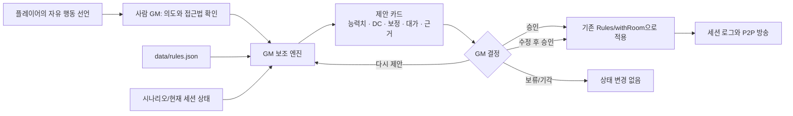
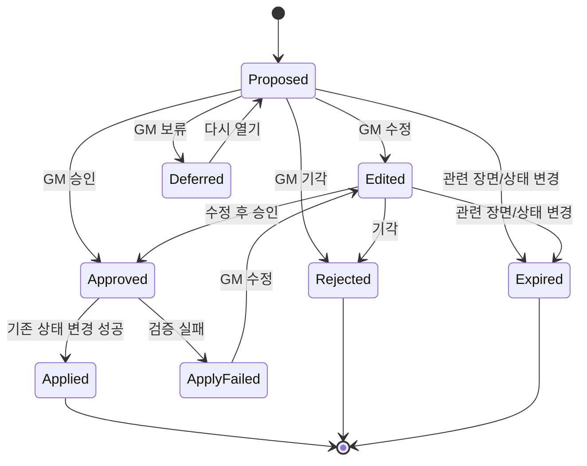
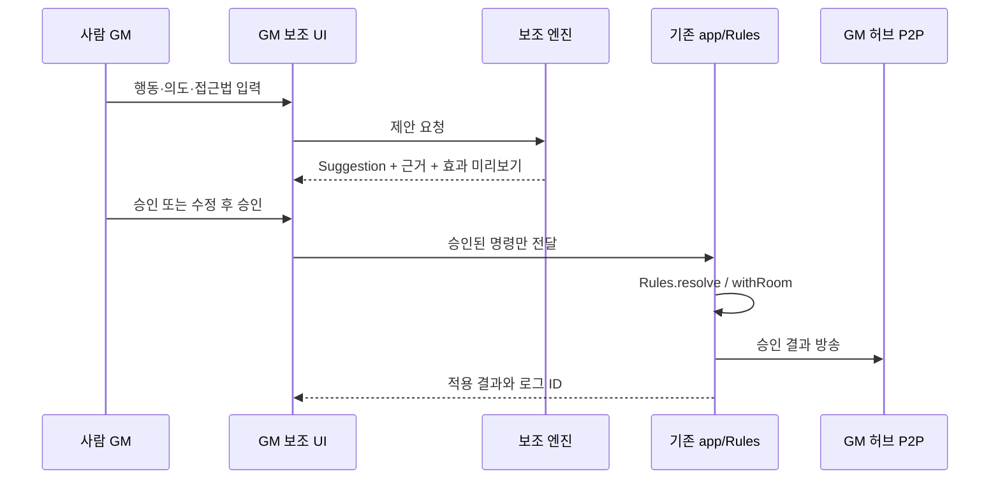

# 07. 사람 GM 권위형 보조 엔진

**문서 상태**: 설계 확정 · 구현 전

**선행 조건**: 명세 02 완료. 장면 진행 제안은 명세 05 완료 후 활성화

**예상 소유 파일**: `data/gm-assistant.json`, `web/src/gm-assistant.js`,
`web/src/ui-gm-assistant.js`, `web/template.html`, `web/src/app.js`,
`web/src/ui.js`, `web/src/ui-net.js`, `tools/build.mjs`,
`tools/test-gm-assistant.mjs`, `tools/verify-gm-assistant.mjs`, `package.json`

> 이 문서에서 “AI”는 상용 LLM이나 자연어 생성 모델을 뜻하지 않습니다.
> 합경의 규칙과 현재 세션 상태를 입력받아 정해진 후보를 계산하는
> **결정론적 규칙 기반 GM 보조 엔진**을 뜻합니다.

---

## 0. 한 문장 정의

> 합경은 **사람 GM 권위형 시스템**이다. 보조 엔진은 판정·대가·진행 후보와
> 그 근거를 제안할 수 있지만, 세계관 판단·비밀 공개·장면 전환·게임 상태
> 변경은 사람 GM의 명시적 승인 후에만 확정된다.

이 원칙은 편의 기능보다 우선합니다. 구현이 편하더라도 엔진이 승인 없이
`ROOM`, 캐릭터 상태, 전투 상태, 시나리오 진행 상태를 바꾸면 안 됩니다.

---

## 1. 목표와 비목표

### 목표

1. 규칙서에 없는 자유 행동도 GM이 5초 안에 공정하게 판정하도록 돕는다.
2. 능력치·기술·DC·상황 보정·부분 성공 대가를 한 화면에서 제안한다.
3. GM이 놓치기 쉬운 시간, 잔향 곡선, 미회수 단서, NPC 상태를 알려준다.
4. 모든 제안에 **판단 근거**와 **적용될 변화**를 함께 보여준다.
5. GM이 제안을 승인·수정·보류·기각할 수 있게 한다.
6. 기존 오프라인 우선, GM 허브, 비밀 분리 원칙을 유지한다.

### 비목표

- 자연어의 의미를 완전히 이해하는 범용 AI
- 사람 GM 없이 시나리오를 자율 운영하는 모드
- 새로운 설정·NPC·규칙·게임 수치를 즉석에서 창작하는 기능
- 플레이어 행동의 허용 목록 또는 선택지 강제
- 승인 없는 장면 전환, 비밀 공개, 상태 변경
- 상용 LLM API, 외부 서버, 계정, API 키, 런타임 의존성 추가

명세 08의 [시나리오 디렉터](08-scenario-director.md)는 사람이 미리 작성하고
GM이 승인한 장면 큐를 자동 재생할 수 있습니다. 이것은 새로운 이야기나 선택을
자율 생성하는 모드가 아니라, 승인된 연출 구간을 재생하는 기능입니다.

자유 행동은 제한하지 않습니다. 대신 사람이 행동의 **의도와 접근법**을
구조화하면 엔진이 기존 규칙에 맞춰 계산합니다.

---

## 2. 설계 결정

| ID | 결정 | 이유 |
|---|---|---|
| D-01 | 사람 GM이 유일한 최종 권위다 | TRPG의 창의적·맥락적 판단을 규칙표만으로 완전 대체할 수 없다 |
| D-02 | 엔진은 제안 객체만 만든다 | 계산과 상태 변경을 분리해야 승인 경계를 검증할 수 있다 |
| D-03 | 자연어 자동 해석을 하지 않는다 | LLM 없이 임의 문장의 의도·상식·설정 적합성을 신뢰성 있게 판정할 수 없다 |
| D-04 | 기존 `Rules.resolve`와 `Rules.modifiers`를 재사용한다 | 판정 규칙이 두 벌이 되는 것을 막는다 |
| D-05 | 상황 보정은 DC 이동 `-4..+4`만 사용한다 | `data/rules.json`의 정본과 룰북 1.4를 그대로 따른다 |
| D-06 | 제안 상태는 `ROOM` 밖의 GM 전용 저장소에 둔다 | 플레이어에게 판단 근거·비밀 단서가 방송되는 것을 막는다 |
| D-07 | 같은 입력은 같은 제안을 만든다 | GM이 결과를 설명하고 테스트로 재현할 수 있어야 한다 |
| D-08 | 무작위성은 GM이 굴림을 승인한 순간에만 발생한다 | 후보 추천이 새로고침마다 바뀌는 것을 막는다 |
| D-09 | 장면 진행 제안은 시나리오 데이터만 참조한다 | 문서에 없는 진상·수치·사건을 엔진이 지어내지 않게 한다 |
| D-10 | 창의성은 “보너스 점수”가 아니라 실제 위치·효과 변화로 보상한다 | 말솜씨 경쟁과 보정 중복을 막고 허구 속 행동을 존중한다 |

---

## 3. 권위와 데이터 흐름



보조 엔진은 `ROOM`을 직접 변경하지 않습니다. 오직 다음과 같은
`Suggestion`을 반환합니다.

```jsonc
{
  "id": "suggestion-...",
  "kind": "check",
  "status": "proposed",
  "summary": "균열에 검을 꽂아 통로를 유지한다",
  "reason": [
    "폭주하는 차원 현상에 직접 개입하므로 기본 DC 18",
    "위상 무기는 유의미한 이점이므로 DC -2"
  ],
  "check": {
    "abilityId": "STR",
    "skillId": null,
    "baseDc": 18,
    "dcShift": -2,
    "finalDc": 16
  },
  "outcomes": {
    "crit": "3라운드 유지 + 무기 손상 없음",
    "success": "3라운드 동안 통로 유지",
    "partial": "통로 유지 + 무기 손상 또는 잔향 1d6",
    "fail": "통로 폐쇄 + 행동자가 반대편에 고립"
  },
  "effectPreview": [],
  "sourceRefs": ["rulebook:1.4", "rules:dcTable:very-hard"]
}
```

`effectPreview`는 승인 시 바뀔 수 있는 상태를 미리 보여주기 위한 목록입니다.
제안 단계에서는 실행하지 않습니다.

제안에는 실행 함수나 임의의 상태 경로를 넣지 않습니다. 승인된 변화는 다음처럼
화이트리스트에 있는 명령 데이터로만 전달합니다.

```jsonc
{
  "suggestionId": "suggestion-...",
  "stateRevision": "...",
  "decision": "approved",
  "check": { "abilityId": "STR", "skillId": null, "dc": 16 },
  "effects": [
    {
      "type": "character.adjust",
      "characterName": "이든",
      "field": "radiation",
      "dice": "1d6",
      "reason": "부분 성공 대가"
    },
    {
      "type": "log.append",
      "text": "균열을 3라운드 동안 유지합니다."
    }
  ]
}
```

초기 허용 명령은 `character.adjust`, `character.set`, `log.append`,
`initiative.add`, `scene.set`으로 제한합니다. 필드별 범위 검증은 기존 GM 허브와
같이 HP `0..maxHp`, 잔향 `0..100`, 결정편 `0 이상`을 적용합니다. 알 수 없는
명령·필드·캐릭터·씬 ID는 무시하지 말고 승인 적용을 실패시켜 GM에게 보여줍니다.
주사위 표현은 승인 뒤 한 번만 굴리고 실제 결과를 로그에 남깁니다.

---

## 4. 권한 행렬

| 기능 | 시스템 자동 처리 | 엔진 제안 | GM 승인 |
|---|---:|---:|---:|
| 주사위 합산·숙련·부상·잔향 보정 | 가능 | 불필요 | 예외 수정만 |
| 자유 행동의 능력치·기술 선택 | 불가 | 가능 | 필수 |
| 기본 DC·상황 보정 | 불가 | 가능 | 필수 |
| 부분 성공의 대가 | 불가 | 2~3개 후보 | 필수 |
| 대성공의 부가 이득 | 불가 | 1~2개 후보 | 필수 |
| NPC 행동·돌발 사건 | 불가 | 가능 | 필수 |
| 장면 전환·단서 공개 | 불가 | 가능 | 필수 |
| 캐릭터 비밀 공개 | 불가 | 공개 시점 알림만 | 필수 |
| HP·잔향·자원 변경 | 승인 후 자동 | 변화량 미리 표시 | 필수 |
| 라운드·턴·타이머 계산 | 가능 | 알림 가능 | 불필요 |
| 룰 근거 표시·세션 요약 | 가능 | 가능 | 불필요 |

“자동 처리”는 창작적 판단이 없는 계산과 기록만 뜻합니다. 시스템이 자동으로
계산한 값도 GM은 적용 전에 효과 미리보기에서 확인할 수 있어야 합니다.

---

## 5. 자유 행동 5초 판정 규칙

### 5.1 판정이 필요한가

다음 중 하나 이상이면 판정합니다.

- 성공 여부가 불확실하다.
- 실패·지연이 현재 장면을 의미 있게 바꾼다.
- HP, 잔향, 결정편, 장비, 시간 같은 자원이 걸려 있다.
- 적·환경·차원 법칙이 행동을 방해한다.

모두 아니면 판정 없이 성공합니다. 판정 실패가 이야기에 아무 변화도 만들지
않는다면 굴림을 요구하지 않습니다.

설정상 성립하지 않는 행동은 “거의 불가능 DC 22”로 떠넘기지 않습니다.
판정 없이 불가능하다고 말하고, 성립시키기 위한 조건을 제시합니다.

```text
불가능: 맨손으로 공간을 찢어 순간이동한다.
가능 조건: 위상 장비를 확보하거나, 열린 균열의 좌표를 먼저 고정한다.
```

### 5.2 의도와 접근법

GM은 행동 선언에서 두 가지를 확정합니다.

- **의도**: 무엇을 얻으려 하는가
- **접근법**: 어떤 방식으로 이루려 하는가

같은 의도라도 접근법이 다르면 능력치와 결과가 달라집니다.

| 접근법 | 기본 능력치 | 예시 |
|---|---|---|
| 밀기·부수기·붙잡기 | STR | 문 뜯기, 적 제압, 구조물 버티기 |
| 피하기·숨기·정밀 조작 | AGI | 낙하물 회피, 장치 낚아채기 |
| 버티기·억누르기·지속 | CON | 독기 견디기, 장시간 결계 유지 |
| 분석·설계·해체 | INT | 술식 해체, 장치 개조 |
| 관찰·추적·직감 | WIS | 거짓말 간파, 흔적 추적 |
| 설득·협박·지휘 | CHA | 협상, 도발, 군중 통제 |

둘 이상의 능력치가 타당하면 GM은 플레이어가 실제로 묘사한 접근법과 가장
가까운 하나를 제안합니다. 높은 능력치를 쓰기 위해 굴림 직전에 접근법만
바꾸는 것은 허용하지 않습니다. 접근법을 실제로 바꾸면 새 제안을 만듭니다.

### 5.3 기술과 숙련

1. `RULES.skills`에 정확한 기술이 있으면 그 기술을 사용합니다.
2. 별칭이 있으면 `Rules.modifiers`의 기존 별칭 판정을 사용합니다.
3. 맞는 기술이 없으면 능력치 직접 판정으로 처리합니다.
4. 새 기술을 즉석에서 영구 등록하거나 숙련 `+2`를 추측하지 않습니다.

### 5.4 기본 DC

`data/rules.json`의 값을 그대로 사용합니다.

| 난이도 | DC | 판단 기준 |
|---|---:|---|
| 쉬움 | 8 | 방해가 거의 없고 실수하기도 어렵다 |
| 보통 | 12 | 일반인이 집중해야 성공한다 |
| 어려움 | 15 | 숙련자도 실패할 수 있다 |
| 매우 어려움 | 18 | 극한 환경, 정예 저항, 복합 장애물 |
| 거의 불가능 | 22 | 특별한 준비 없이 성공하기 어렵다 |

DC는 캐릭터 능력치가 아니라 **행동 자체와 저항의 난이도**로 결정합니다.
능력치가 높은 캐릭터라고 DC를 올리거나, 낮다고 DC를 내려주지 않습니다.

빠른 기준:

- 일반 장애물·보통 사람: DC 12
- 위험한 환경·훈련된 상대: DC 15
- 극한 환경·정예 상대: DC 18
- 보스급 존재·차원 법칙 직접 개입: DC 22

### 5.5 상황 보정

상황 보정은 굴림값에 새 보너스를 더하지 않고 DC를 이동합니다.

- **작은 이점/불리**: 결과에 실질적 차이가 없으면 0
- **유의미한 이점/불리**: DC `-2` 또는 `+2`
- **결정적인 이점/불리**: DC `-4` 또는 `+4`

최종 이동 범위는 반드시 `-4..+4`로 제한합니다.

```text
최종 DC = 기본 DC + clamp(불리 이동 + 유리 이동, -4, +4)
```

유리 후보:

- 행동에 정확히 맞는 장비·능력
- 이전 장면에서 확보한 구체적 단서나 준비
- 실제로 위험을 줄이는 환경 활용
- 역할이 분명한 동료 협력
- 이미 밝혀진 상대의 약점 활용

불리 후보:

- 즉각적인 시간 압박
- 손상되거나 부적합한 장비
- 핵심 정보·시야 부족
- 서로 충돌하는 목표를 동시에 달성하려 함
- 구역 법칙이나 상성의 직접적인 방해
- 앞선 실패로 이미 악화된 상황

같은 사실을 여러 이름으로 중복 계산하지 않습니다. “도구 준비”, “장비 준비”,
“철저한 준비”가 모두 같은 장비 하나를 가리키면 한 번만 반영합니다.

### 5.6 창의적인 행동의 보상

창의성이라는 말 자체에는 보정을 주지 않습니다. 제안된 행동이 실제 허구 속
상황을 바꿀 때 다음 중 **하나**를 권합니다.

1. 원래 불가능했던 행동 가능성을 연다.
2. DC를 `-2` 또는 `-4` 이동한다.
3. 성공 시 부가 효과 하나를 추가한다.

한 아이디어에 세 혜택을 모두 자동 적용하지 않습니다. 효과가 여러 적이나 장면
전체에 미친다면 아래 “효과 규모” 규칙을 먼저 적용합니다.

### 5.7 효과 규모

효과가 너무 크면 DC만 계속 높이지 않습니다. 다음 중 하나로 범위를 조절합니다.

- 여러 단계의 판정으로 나눈다.
- 더 큰 자원·시간·위험을 요구한다.
- 문제 해결 대신 유리한 위치를 만든다.
- 지속 시간이나 대상 수를 제한한다.

예: “균열 영구 봉쇄”를 한 번에 처리하지 않고, 성공 시 3라운드 안정화로
바꾼 뒤 영구 봉쇄에 필요한 다음 조건을 제시합니다.

---

## 6. 결과와 대가 제안 규칙

결과 판정은 기존 `Rules.resolve`만 사용합니다.

| 결과 | 조건 | 엔진이 제안할 내용 |
|---|---|---|
| 대성공 | 자연 20 또는 DC+10 이상 | 의도 달성 + 부가 이득 1개 |
| 성공 | DC 이상 | 의도한 결과 달성 |
| 부분 성공 | DC-1~DC-4 | 의도 달성 + 대가 후보 2~3개 |
| 실패 | DC-5 이하 또는 자연 1 | 의도 미달성 + 상황 악화 후보 1~2개 |

### 부분 성공 대가 분류

| 분류 | 예시 | 사용 조건 |
|---|---|---|
| 시간 | 지연, 다음 장면 목표 시간 감소 | 시간이 실제 압박일 때 |
| 노출 | 소음, 위치 발각, 적의 주의 | 은밀성·경계가 중요할 때 |
| 자원 | 결정편·소모품·장비 내구 소모 | 사용한 자원과 인과가 있을 때 |
| 신체 | HP 감소, 불리한 위치 | 행동 자체가 신체 위험을 동반할 때 |
| 잔향 | 잔향 획득, 구역 효과 노출 | 차원 현상·술식과 접촉했을 때 |
| 효과 축소 | 시간·범위·대상 수 감소 | 의도는 달성하되 완전 성공과 구분할 때 |
| 관계 | NPC 신뢰 하락, 빚 발생 | 사회적 행동일 때 |
| 새 위협 | 지원군, 붕괴, 다른 문제 등장 | 이야기를 전진시키는 위협이 있을 때 |

행동과 인과관계가 없는 대가는 제안하지 않습니다. 단순히 벌을 주기 위해 HP나
잔향을 깎거나 올리지 않습니다.

### 실패 처리

실패해도 이야기가 멈추면 안 됩니다.

- 같은 판정을 아무 변화 없이 반복할 수 없습니다.
- 새로운 정보, 위험, 비용, 위치 변화 중 하나는 발생해야 합니다.
- 다시 시도하려면 접근법·상황·자원이 달라져야 합니다.
- 핵심 단서는 실패로 영구 소실시키지 않습니다. 더 큰 비용으로 발견하게 합니다.

### 대성공 부가 이득

- 더 빠르게 완료
- 자원 소모 없음
- 추가 단서 또는 유리한 위치
- 효과 범위·지속 시간 증가
- 다음 관련 판정의 유의미한 이점

부가 이득은 원래 행동과 관계있는 것만 제안합니다.

---

## 7. 제안 엔진 알고리즘

### 7.1 판정 제안

```text
입력 검증
  ├─ GM인가? 아니면 종료
  ├─ 의도와 접근법이 있는가? 아니면 보완 요청
  └─ 설정상 가능한가?
       ├─ 불가능 → 조건 제안, 굴림 없음
       └─ 가능
            ↓
판정 필요성 판단
  ├─ 불확실성/의미 있는 실패/위험 모두 없음 → 자동 성공 제안
  └─ 하나 이상 있음
            ↓
능력치·기술 후보 계산
            ↓
기본 DC 선택
            ↓
상황 이동 계산 및 -4..+4 제한
            ↓
4단계 결과별 효과 후보 생성
            ↓
근거·출처·효과 미리보기를 포함한 Suggestion 반환
            ↓
GM 승인 전까지 상태 변경 없음
```

참고 의사코드:

```js
function proposeCheck(input, rules) {
  if (!input.isGM) return { error: 'gm-only' };
  if (!input.intent || !input.approach) return { needs: ['intent', 'approach'] };
  if (input.possibility === 'impossible') return proposeRequiredConditions(input);
  if (!hasMeaningfulUncertainty(input)) return proposeAutomaticSuccess(input);

  const match = matchAbilityAndSkill(input, rules);
  const baseDc = rules.dcTable.find((row) => row.dc === input.baseDc).dc;
  const dcShift = clamp(scoreSituation(input.factors), -4, 4);

  return {
    kind: 'check',
    status: 'proposed',
    check: { ...match, baseDc, dcShift, finalDc: baseDc + dcShift },
    outcomes: proposeOutcomes(input),
    reason: explainDecision(input, match, baseDc, dcShift),
    effectPreview: [],
  };
}
```

`matchAbilityAndSkill`, `scoreSituation`, `proposeOutcomes`는 입력을 변경하지 않는
순수 함수여야 합니다. 같은 입력에서 후보 순서까지 같아야 합니다.

### 7.2 장면 진행 제안

명세 05의 시나리오 데이터가 있을 때만 활성화합니다.

```text
현재 Act/씬
 + 실제 경과 시간과 목표 시간
 + 파티 평균 잔향과 목표 곡선
 + 확보/미확보 단서 ID
 + 등장/퇴장한 NPC ID
 + 최근 실패·부분 성공 횟수
                 ↓
           조건 규칙 평가
                 ↓
우선순위 = 긴급도 + 시나리오 관련성 + 미회수 중요도
                 ↓
상위 3개 후보만 GM에게 표시
```

우선순위가 같으면 `data/gm-assistant.json`의 규칙 선언 순서로 결정합니다.
엔진이 임의의 사건을 생성하지 않고 데이터에 정의된 후보만 제안합니다.

제안 예:

- “Act 1 목표 시간보다 12분 지연: 다음 조사 장면 압축 검토”
- “평균 잔향 18, Act 1 목표 20~25: 추가 잔향 사건은 아직 불필요”
- “필수 단서 `ticket-log` 미회수: 장면 종료 전 대체 발견 경로 제안”
- “NPC `conductor`가 25분 동안 반응하지 않음: 행동 후보 2개 표시”

### 7.3 제안 수명주기



제안 생성 당시의 `stateRevision`과 현재 상태가 다르면 적용하지 않고 만료시킵니다.
오래된 제안으로 HP·장면·단서를 덮어쓰는 일을 막기 위한 최소 장치입니다.

`stateRevision`을 위해 `ROOM`에 새 카운터를 넣지는 않습니다. 제안이 실제로
참조한 필드만 키 순서가 고정된 JSON으로 직렬화해 서명을 만들고, 적용 직전에
같은 필드를 다시 직렬화해 비교합니다. 예를 들어 HP 변경 제안은 대상 캐릭터의
HP와 maxHP, 장면 전환 제안은 현재 Act·씬·단서 목록만 비교합니다. 관련 없는
플레이어의 메모 변경 때문에 제안 전체가 만료되어서는 안 됩니다.

---

## 8. GM 승인 UI

### 8.1 위치

GM 대시보드 안에 `GM 보조` 영역을 추가합니다. `ctx.isGM`이 아니면 DOM 자체를
만들지 않습니다. 플레이어 화면에는 탭, 배지, 제안 개수 모두 보이지 않습니다.

```text
┌ GM 보조 ───────────────────────────────────────────────────┐
│ 자유 행동 판정                                             │
│ 행동: [균열에 검을 꽂아 통로를 유지한다                 ] │
│ 의도: [일행이 통과할 시간을 번다                        ] │
│ 접근: [STR ▾]  기술: [능력치 직접 판정 ▾]                │
│                                                             │
│ 제안  매우 어려움 18 → 위상 무기 -2 → 최종 DC 16          │
│ 근거  차원 현상 직접 개입 / 적합한 장비 사용               │
│                                                             │
│ 대성공  3라운드 유지 + 무기 손상 없음                      │
│ 성공    3라운드 유지                                       │
│ 부분    유지 + [무기 손상 ▾]                               │
│ 실패    통로 폐쇄 + 행동자 고립                            │
│                                                             │
│ 적용 예정: 아직 없음                                       │
│ [승인 및 판정] [수정] [다시 제안] [보류] [기각]            │
└─────────────────────────────────────────────────────────────┘
```

### 8.2 제안 카드 필수 정보

모든 카드에 다음을 표시합니다.

1. 제안 내용
2. 판단 근거
3. 참조 규칙 또는 시나리오 ID
4. 승인 시 적용될 상태 변화
5. 불확실하거나 GM이 정해야 하는 항목
6. 승인·수정·다시 제안·보류·기각 버튼

근거 없는 숫자만 보여주면 안 됩니다. 예를 들어 `DC 18` 대신
“폭주하는 차원 현상에 직접 개입하므로 매우 어려움 DC 18”이라고 표시합니다.

### 8.3 승인 동작



`승인 및 판정`은 판정 조건을 확정한 뒤 기존 주사위 UI를 실행합니다.
결과가 부분 성공이면 대가를 선택하기 전까지 상태를 변경하지 않습니다.

### 8.4 오류와 경고

- 설정상 불가능: 굴림 버튼 대신 필요한 조건 표시
- 기술 불명: 능력치 직접 판정 제안
- 보정 범위 초과: `-4..+4`로 제한하고 잘린 이유 표시
- 상태가 바뀐 오래된 제안: 적용 차단 후 다시 제안
- GM이 아님: UI 미렌더링 및 적용 함수 거절
- 시나리오 데이터 없음: 자유 행동 보조만 제공, 진행 제안 숨김

---

## 9. 저장·동기화·비밀 경계

### 9.1 저장 위치

제안과 GM 판단 메모는 `ROOM`에 넣지 않습니다.

```text
hg:{code}:assistant
```

저장 대상:

- 현재 작성 중인 제안
- 보류된 제안
- 승인·기각 이력의 최소 메타데이터
- 시나리오 진행 보조 상태(현재 씬 ID, 확인한 알림 ID)

기본 세션 로그에는 승인되어 실제로 발생한 결과만 기록합니다. 기각된 아이디어나
GM의 비공개 메모는 플레이어 로그에 남기지 않습니다.

### 9.2 P2P

- `assistant` 상태는 `Net.send()`에 넣지 않습니다.
- 플레이어의 브라우저 메모리로 제안 근거를 전송하지 않습니다.
- 승인된 결과만 기존 `withRoom()`과 `filterRoomFor()` 경로를 탑니다.
- 플레이어가 조작한 메시지로 제안 승인 함수를 호출할 수 없어야 합니다.

### 9.3 GM 인계

`세션 상태 내보내기`에는 GM 인계용으로 `assistant`를 선택적으로 포함합니다.

```jsonc
{
  "v": 2,
  "roomCode": "ABCD",
  "room": {},
  "assistant": {},
  "gmOnly": true
}
```

이 파일은 기존 `secrets.json`과 마찬가지로 GM 전용임을 UI에 명시합니다.
플레이어에게 배포하는 `web/index.html`에는 세션별 제안·메모가 들어가지 않습니다.

### 9.4 비밀

- 엔진은 비밀의 본문을 제안 카드에 자동 복사하지 않습니다.
- 필요한 경우 “이 장면에서 캐릭터 비밀 공개 시점 검토”라는 알림만 냅니다.
- 실제 비밀 본문과 공개 대상은 기존 `Net.setSecrets` 경계를 따릅니다.
- 시나리오 데이터에 없는 진상이나 비밀을 엔진이 생성하지 않습니다.

---

## 10. 데이터 설계

`data/gm-assistant.json`은 계산 규칙의 ID·라벨·후보 분류만 가집니다. DC 수치와
판정 결과 임계치는 계속 `data/rules.json`이 정본입니다.

```jsonc
{
  "version": 1,
  "factorLevels": [
    { "id": "none", "dcShift": 0 },
    { "id": "meaningful-advantage", "dcShift": -2 },
    { "id": "decisive-advantage", "dcShift": -4 },
    { "id": "meaningful-disadvantage", "dcShift": 2 },
    { "id": "decisive-disadvantage", "dcShift": 4 }
  ],
  "costCategories": [
    { "id": "time", "label": "시간" },
    { "id": "exposure", "label": "노출" },
    { "id": "resource", "label": "자원" },
    { "id": "harm", "label": "신체" },
    { "id": "resonance", "label": "잔향" },
    { "id": "reduced-effect", "label": "효과 축소" },
    { "id": "relationship", "label": "관계" },
    { "id": "new-threat", "label": "새 위협" }
  ]
}
```

하드코딩 금지 범위:

- DC 8/12/15/18/22
- 숙련 +2
- 결과 임계치
- 부상·잔향 보정
- 시나리오 목표 시간·잔향 곡선·NPC 스탯

이 값들은 각각 기존 `rules.json`과 명세 05의 시나리오 데이터를 참조합니다.

---

## 11. 기능 명세

### 판정 보조

| ID | 요구사항 |
|---|---|
| GA-001 | GM은 자유 행동의 행동문·의도·접근법을 입력할 수 있다 |
| GA-002 | 엔진은 판정 필요·자동 성공·설정상 불가능 중 하나를 제안한다 |
| GA-003 | 엔진은 능력치와 기존 기술 후보를 근거와 함께 제안한다 |
| GA-004 | 엔진은 기존 DC표 중 하나만 기본 DC로 선택한다 |
| GA-005 | 상황 보정은 `-4..+4` 범위의 DC 이동으로만 계산한다 |
| GA-006 | 4단계 결과별 효과를 GM이 판정 전에 확인·수정할 수 있다 |
| GA-007 | 부분 성공에는 인과관계가 있는 대가 후보 2~3개를 제안한다 |
| GA-008 | 승인 전에는 세션 상태가 변경되지 않는다 |
| GA-009 | 승인된 판정은 기존 `Rules.resolve`와 `Rules.modifiers`를 사용한다 |

### 진행 보조

| ID | 요구사항 |
|---|---|
| GA-101 | 현재 씬의 목표 시간 대비 지연을 계산한다 |
| GA-102 | 파티 평균 잔향과 시나리오 목표 곡선을 비교한다 |
| GA-103 | 미회수 필수 단서와 미반응 중요 NPC를 알린다 |
| GA-104 | 데이터에 정의된 진행 후보만 최대 3개 표시한다 |
| GA-105 | 장면 전환·NPC 행동·단서 공개는 GM 승인 후에만 적용한다 |

### 승인과 기록

| ID | 요구사항 |
|---|---|
| GA-201 | GM은 승인·수정 후 승인·다시 제안·보류·기각할 수 있다 |
| GA-202 | 모든 제안은 근거·출처·효과 미리보기를 포함한다 |
| GA-203 | 상태 리비전이 달라진 오래된 제안은 적용할 수 없다 |
| GA-204 | 승인되어 실제 발생한 결과만 공용 로그에 기록한다 |
| GA-205 | GM 전용 제안 상태는 플레이어에게 전송되지 않는다 |
| GA-206 | GM 인계 파일에 보조 상태를 포함하거나 제외할 수 있다 |

### 접근성과 운영

| ID | 요구사항 |
|---|---|
| GA-301 | 모든 기능은 키보드만으로 사용할 수 있다 |
| GA-302 | 색상만으로 제안 상태와 위험도를 구분하지 않는다 |
| GA-303 | 버튼 이름은 결과를 설명한다 (`승인 및 판정`, `기각`) |
| GA-304 | 네트워크가 없어도 자유 행동 판정 보조가 동작한다 |
| GA-305 | 시나리오 데이터가 없어도 기존 세션 기능은 정상 동작한다 |

---

## 12. 대표 판단 예시

### 예시 A — 환경을 이용한 창의적 공격

> “샹들리에를 떨어뜨려 경비병들을 막고, 그 틈에 도망칩니다.”

- 의도: 추격 차단
- 접근법: AGI로 고정 장치를 정확히 끊기
- 기본 DC: 어려움 15
- 이점: 구조를 미리 조사했다면 유의미한 이점 `-2`
- 효과 규모: 피해로 전투를 끝내지 않고 한 구역을 1라운드 봉쇄
- 부분 성공: 봉쇄 성공 + 큰 소음 또는 일행 한 명이 뒤처짐
- 실패: 장치가 걸려 통로가 막히지 않고 경비가 위치를 파악

### 예시 B — 설정상 바로 성립하지 않는 행동

> “맨손으로 균열을 찢어 목적지로 이동합니다.”

- 판정 없음
- 이유: 현재 설정과 캐릭터 능력으로 공간 개방 수단이 없음
- 필요 조건 후보: 위상 장비 확보 / 기존 균열 좌표 발견 / 관련 NPC 도움

엔진은 DC 22를 제안하지 않습니다. 설정 보호는 난이도 문제가 아닙니다.

### 예시 C — 사회적 돌발 행동

> “수금원의 탐욕을 이용해 가짜 거래를 제안합니다.”

- 의도: 전투 없이 통과
- 접근법: CHA 협상 또는 INT 기만 중 실제 묘사에 맞는 하나
- 기본 DC: 상대가 경계 중이면 어려움 15
- 이점: 상대의 탐욕을 앞서 확인했다면 유의미한 이점 `-2`
- 성공: 통과
- 부분 성공: 통과 + 결정편 지불 또는 나중에 빚 발생
- 실패: 거래 거절 + 수금원이 제안자의 목적을 눈치챔

---

## 13. 구현 순서

1. **순수 제안 엔진**
   - `data/gm-assistant.json`
   - `web/src/gm-assistant.js`
   - 판정 필요성, 능력치·기술 후보, DC 이동, 대가 후보
2. **GM 승인 UI**
   - `web/src/ui-gm-assistant.js`
   - 제안 카드, 수정, 승인, 보류, 기각
3. **기존 상태 적용 배선**
   - 승인된 명령만 `Rules`와 `withRoom`으로 전달
   - `stateRevision` 검사
4. **GM 전용 저장·인계**
   - `hg:{code}:assistant`
   - 내보내기 v2 및 가져오기
5. **시나리오 진행 보조**
   - 명세 05 완료 후 시간·잔향·단서·NPC 알림 활성화

1~4는 시나리오 데이터 없이 구현할 수 있습니다. 5만 명세 05에 의존합니다.

---

## 14. 검증 전략

### 단위 검사

- 같은 입력은 항상 같은 제안과 후보 순서를 반환
- 기본 DC는 `rules.json`에 존재하는 값만 허용
- 상황 보정은 `-4..+4`로 제한
- 설정상 불가능은 굴림 제안 없음
- 판정 불필요 조건은 자동 성공 제안
- 부분 성공 대가는 입력과 관련된 분류만 반환
- 제안 생성만으로 Store와 `ROOM`이 바뀌지 않음
- 오래된 `stateRevision` 제안 적용 거절
- 비GM 승인 호출 거절

### 브라우저 검사

- GM 화면에만 `GM 보조` 영역 표시
- 플레이어 DOM과 브라우저 상태에 제안 근거·GM 메모 없음
- 승인 전후 Store를 비교해 승인 전 변경 0건
- 수정 후 승인한 DC와 결과가 로그에 정확히 기록
- 부분 성공에서 대가를 고르기 전 상태 변경 없음
- 네트워크 차단 상태에서도 판정 보조 동작
- 시나리오 데이터가 없으면 진행 보조만 숨고 나머지 기능 정상
- GM 상태 내보내기 → 다른 탭 가져오기 → 보류 제안 복원

### 수동 QA

다음 세 가지 실제 선언을 GM이 입력해 5초 안에 제안 카드를 완성할 수 있는지
측정합니다.

1. 환경을 이용한 물리 행동
2. 규칙에 없는 사회적 행동
3. 설정상 불가능하지만 가능 조건을 제시할 수 있는 행동

자동 테스트가 통과해도 GM이 제안 근거를 이해하거나 수정하기 어렵다면 완료가 아닙니다.

---

## 15. 완료 조건

- [ ] `npm run verify`와 기존 audit 결과가 유지됨
- [ ] 별도 GM 보조 단위 검사 전부 통과
- [ ] 별도 브라우저 검사 전부 통과
- [ ] 제안 생성·수정·보류·기각만으로 `ROOM` 변경 0건
- [ ] 승인된 명령만 기존 `Rules`/`withRoom` 경로로 적용
- [ ] GM이 아닌 클라이언트에서 보조 UI와 승인 API 모두 접근 불가
- [ ] 플레이어에게 GM 제안·근거·메모·비밀 본문이 전송되지 않음
- [ ] 상황 DC 이동이 모든 경로에서 `-4..+4`를 넘지 않음
- [ ] 자연 20·자연 1·부분 성공 경계가 기존 `Rules.resolve`와 동일
- [ ] 네트워크와 외부 요청 없이 판정 보조가 정상 동작
- [ ] 같은 입력으로 같은 제안을 재현할 수 있음
- [ ] 실제 자유 행동 3종을 GM이 5초 안에 판정 카드로 만들 수 있음

---

## 16. 구현자에게 남기는 최종 경계

이 기능의 목적은 GM 대신 이야기를 쓰는 것이 아닙니다. GM이 이미 내려야 하는
판단을 빠뜨리지 않고, 기존 규칙 안에서 빠르게 설명하고, 승인된 결과를 정확히
기록하는 것이 목적입니다.

다음 코드는 이 명세를 위반합니다.

```js
// 금지: 추천 함수가 상태를 직접 변경
function recommendAndApply(room, input) {
  room.characters[input.target].hp -= 3;
}
```

다음 구조가 맞습니다.

```js
// 허용: 순수 제안 → 사람 GM 승인 → 기존 상태 변경 경로
const suggestion = propose(input, snapshot);
const approved = await askGM(suggestion);
if (approved) await actions.withRoom((room) => applyApproved(room, approved));
```

판단은 사람에게, 계산과 기억은 도구에게 둡니다.
