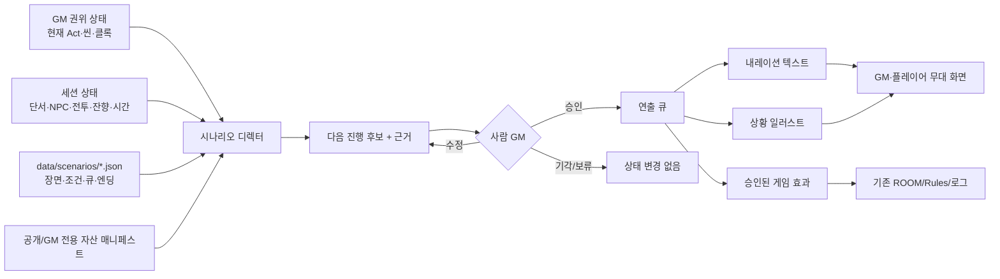
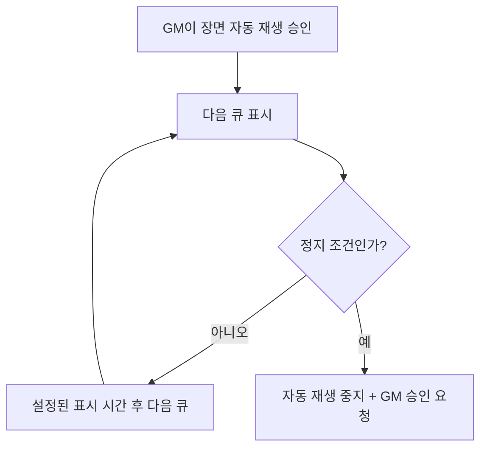
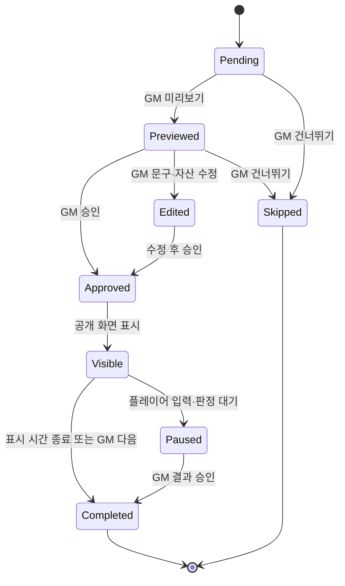
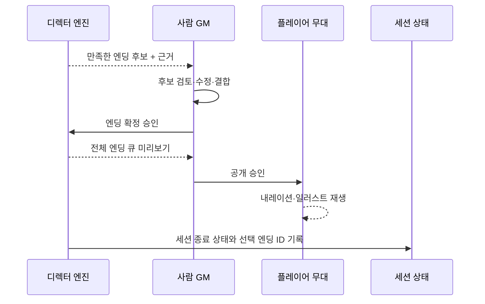

# 08. 시나리오 디렉터 — 스토리·클라이맥스·엔딩 연출

**문서 상태**: 설계 확정 · 구현 전

**선행 조건**: 명세 05 시나리오 데이터화, 명세 07 사람 GM 권위형 보조 엔진

**예상 소유 파일**: `data/scenarios/**`, `assets/scenes/**`,
`web/src/scenario-director.js`, `web/src/ui-scenario-director.js`,
`web/src/net.js`, `web/src/ui-net.js`, `web/template.html`, `web/src/app.js`,
`web/src/ui.js`, `tools/build.mjs`, `tools/audit.mjs`,
`tools/test-scenario-director.mjs`, `tools/verify-scenario-director.mjs`,
`package.json`

> 이 명세의 자동 진행은 AI가 이야기를 즉석에서 창작하는 기능이 아닙니다.
> 사람이 미리 작성한 시나리오 데이터, 내레이션, 조건, 전이, 일러스트를
> 규칙 기반 엔진이 현재 상태에 맞춰 재생하는 기능입니다.

---

## 0. 한 문장 정의

> 시나리오 디렉터는 현재 장면·단서·전투·시간·잔향·클록을 평가해 다음
> 스토리 후보를 제안하고, GM이 승인한 구간 안에서 내레이션과 상황 일러스트를
> 자동 재생한다. 자유 행동 해석·비밀 공개·클라이맥스 진입·엔딩 확정은
> 반드시 사람 GM의 승인 지점으로 남긴다.

---

## 1. 목표와 비목표

### 목표

1. 시나리오의 Act·씬·클라이맥스·엔딩을 데이터로 연결한다.
2. 현재 세션 상태로 다음 장면과 전이 후보를 자동 계산한다.
3. 장면 진입·전환·성공·실패 내레이션을 텍스트로 보여준다.
4. 내레이션에 맞는 사전 제작 상황 일러스트를 함께 표시한다.
5. GM이 승인한 비상호작용 구간은 순서대로 자동 재생한다.
6. 판정·선택·비밀·클라이맥스·엔딩 앞에서는 자동으로 멈춘다.
7. 클라이맥스의 단계, 진행 클록, 성공·실패·시간 초과 조건을 관리한다.
8. 만족한 엔딩 후보와 판단 근거를 GM에게 보여준다.
9. 네트워크 없이도 GM 단말에서 모든 연출 기능이 동작한다.
10. 플레이어에게는 승인된 공개 내레이션과 공개 일러스트만 전송한다.

### 비목표

- 규칙 기반 엔진이 새로운 줄거리·대사·NPC·엔딩을 즉석 생성하는 기능
- 플레이어 자유 행동의 의미를 자연어로 자동 판정하는 기능
- GM 승인 없이 비밀을 공개하거나 엔딩을 확정하는 기능
- 세션 중 이미지를 실시간 생성하는 기능
- 외부 이미지 CDN, 상용 LLM, 이미지 생성 API, 서버 의존성
- 시나리오에 없는 장면을 추측해 추가하는 기능
- 플레이어의 선택을 미리 정해진 버튼으로만 제한하는 기능

내레이션과 일러스트는 **사전 작성된 콘텐츠**입니다. 엔진은 현재 상태에 맞는
콘텐츠 ID를 선택하고 안전한 변수만 치환합니다.

---

## 2. 핵심 설계 결정

| ID | 결정 | 이유 |
|---|---|---|
| SD-01 | 자동 진행은 GM이 승인한 장면 구간에서만 동작한다 | 자동화가 사람 GM의 최종 권위를 넘어가지 않게 한다 |
| SD-02 | 스토리는 선언형 장면 그래프로 표현한다 | 코드 수정 없이 시나리오 콘텐츠를 추가하고 검증할 수 있다 |
| SD-03 | 전이 조건은 제한된 조건 DSL만 사용한다 | `eval` 없이 안전하고 재현 가능한 판단을 만든다 |
| SD-04 | 내레이션은 사전 작성 템플릿만 사용한다 | 규칙 기반 엔진이 설정 밖 문장을 지어내지 않게 한다 |
| SD-05 | 일러스트는 사전 제작 자산 ID로 선택한다 | 오프라인·무외부요청 원칙을 유지한다 |
| SD-06 | 공개 자산만 공용 HTML에 포함한다 | 플레이어의 소스 열람으로 스포일러가 유출되는 것을 막는다 |
| SD-07 | GM 전용 진상·이미지는 별도 GM 팩으로 분리한다 | 기존 `secrets.json`과 같은 “안 보내기” 경계를 유지한다 |
| SD-08 | 엔딩 조건은 자동 감지하되 엔딩 확정은 GM이 한다 | 숨은 맥락·플레이어 선택을 기계가 덮어쓰지 않게 한다 |
| SD-09 | 같은 상태에서는 같은 전이 후보와 우선순위를 반환한다 | 디버깅·테스트·설명 가능성을 보장한다 |
| SD-10 | 플레이어는 전체 시나리오 상태를 받지 않는다 | 다음 장면·비밀 조건·미선택 엔딩 노출을 막는다 |
| SD-11 | 그림이 없어도 텍스트만으로 정상 진행한다 | 자산 제작이 게임 실행의 필수 조건이 되지 않게 한다 |
| SD-12 | 승인된 공개 큐만 P2P로 방송한다 | 네트워크 계층이 스토리 정본이나 판단 계층이 되지 않게 한다 |

---

## 3. 전체 구조



### 책임 분리

| 구성요소 | 책임 | 하지 않는 일 |
|---|---|---|
| 시나리오 데이터 | 장면·조건·큐·전이·클라이맥스·엔딩 정의 | 런타임 상태 변경 |
| 디렉터 엔진 | 조건 평가, 후보 정렬, 큐 준비 | 직접 적용, 임의 창작 |
| GM 보조 UI | 미리보기, 승인, 수정, 재생 제어 | 권한 없는 플레이어 조작 허용 |
| 기존 app/Rules | 승인된 판정과 상태 변경 | 다음 스토리 선택 |
| Net | 승인된 공개 큐와 결과 전달 | 전체 시나리오·GM 메모 전송 |
| 플레이어 무대 | 공개 텍스트·그림 표시 | 조건 평가, 다음 장면 열람 |

---

## 4. 진행 모드

### 4.1 제안 모드

기본값입니다. 엔진은 다음 장면 후보와 근거만 보여줍니다.

```text
다음 장면 후보
1. 코어실 진입 — 필수 단서 3/3, 개찰기 전투 종료
2. 차장의 마지막 거래 — 차장 생존, 빚 플래그 활성

[1번 미리보기] [1번 승인] [2번 미리보기] [직접 선택] [보류]
```

GM 승인 전에는 장면 상태, 공개 화면, 로그가 바뀌지 않습니다.

### 4.2 큐 진행 모드

GM이 `다음 큐`를 누를 때마다 승인된 장면 안에서 한 단계씩 진행합니다.

```text
도입 내레이션 → 배경 그림 → NPC 대사 → 판정 대기 → 결과 큐
```

GM이 가장 세밀하게 페이스를 조절할 수 있는 운영 모드입니다.

### 4.3 승인 구간 자동 재생

GM이 장면 미리보기에서 자동 재생 범위를 승인하면, 다음 정지 지점까지 큐를
순서대로 재생합니다.



자동 재생은 비상호작용 연출을 넘기는 기능입니다. 플레이어가 행동을 선언해야
하는 구간을 자동으로 대신 결정하지 않습니다.

### 4.4 자동 정지 지점

다음 큐 앞에서는 설정과 관계없이 반드시 멈춥니다.

- 플레이어 자유 행동 또는 선택 대기
- 능력치·기술·DC를 정해야 하는 판정
- 부분 성공 대가 선택
- 캐릭터·시나리오 비밀 공개
- NPC의 돌이킬 수 없는 사망·이탈
- 클라이맥스 진입 또는 단계 전환
- 엔딩 후보 선택과 최종 확정
- GM 전용 메모가 붙은 큐
- 현재 상태와 전이 조건이 충돌하거나 후보가 둘 이상 동률

---

## 5. 시나리오 장면 그래프

명세 05의 `data/scenarios/station-0.json`에 다음 구조를 추가합니다.

```jsonc
{
  "id": "station-0",
  "title": "역참-0",
  "startSceneId": "arrival",
  "scenes": [
    {
      "id": "arrival",
      "actId": "act1",
      "title": "사라진 승강장",
      "entryWhen": { "always": true },
      "cues": [
        {
          "id": "arrival-enter",
          "type": "presentation",
          "narrationId": "arrival.enter",
          "artId": "station-platform-normal",
          "audience": "public",
          "autoAdvanceMs": null
        },
        {
          "id": "arrival-question",
          "type": "player-input",
          "prompt": "역참에 들어서며 무엇을 먼저 확인합니까?",
          "pause": "required"
        }
      ],
      "transitions": [
        {
          "id": "arrival-to-investigation",
          "to": "investigation",
          "when": { "flag": "arrivalSurveyed", "equals": true },
          "priority": 100
        }
      ]
    }
  ]
}
```

### 5.1 씬 필수 필드

| 필드 | 의미 |
|---|---|
| `id` | 시나리오 안에서 유일한 안정 ID |
| `actId` | 소속 Act |
| `title` | GM 화면용 장면명 |
| `entryWhen` | 장면 진입 가능 조건 |
| `cues` | 순서대로 재생할 연출 큐 |
| `transitions` | 다음 장면 후보와 조건 |

### 5.2 씬 선택 규칙

1. 현재 씬의 `transitions`만 평가합니다.
2. 조건을 만족한 전이만 후보로 남깁니다.
3. `priority`가 높은 순서로 정렬합니다.
4. 우선순위가 같으면 JSON 선언 순서를 유지합니다.
5. 후보가 하나여도 GM 승인 전에는 전이하지 않습니다.
6. 후보가 없으면 자동 진행을 멈추고 미충족 조건을 표시합니다.
7. 후보가 여럿이면 각각의 충족 근거와 차이를 표시합니다.

엔진은 현재 씬과 연결되지 않은 장면으로 임의 점프하지 않습니다. GM의
`직접 장면 선택`은 가능하지만 경고와 로그를 남깁니다.

---

## 6. 제한된 조건 DSL

조건은 JSON 데이터로만 표현하며 문자열 코드와 `eval`을 금지합니다.

### 6.1 조합 연산자

```jsonc
{ "all": [/* 모든 조건 */] }
{ "any": [/* 하나 이상 */] }
{ "not": {/* 단일 조건 */} }
```

### 6.2 허용 사실과 비교

| 사실 | 비교 | 예시 |
|---|---|---|
| `flag` | `equals` | 특정 사건 발생 여부 |
| `clue` | `equals` | 단서 획득 여부 |
| `clueCount` | `atLeast`, `atMost` | 확보 단서 수 |
| `npc.status` | `equals`, `in` | 생존·적대·협력·이탈 |
| `combat.outcome` | `equals` | 승리·퇴각·협상 종료 |
| `clock` | `atLeast`, `atMost` | 클라이맥스·위협 진행도 |
| `sceneElapsedMinutes` | `atLeast`, `atMost` | 현재 장면 지연 |
| `sessionElapsedMinutes` | `atLeast`, `atMost` | 전체 페이스 |
| `partyAverageResonance` | `atLeast`, `atMost` | 잔향 곡선 |
| `character.status` | `equals`, `in` | 특정 캐릭터 상태 |
| `choice` | `equals`, `in` | GM이 승인한 플레이어 선택 |

예:

```jsonc
{
  "all": [
    { "clueCount": "required", "atLeast": 3 },
    { "npc.status": "conductor", "in": ["defeated", "allied"] },
    { "partyAverageResonance": true, "atMost": 85 }
  ]
}
```

알 수 없는 사실·연산자·ID를 만나면 조건을 거짓으로 처리하고 조용히 넘어가지
않습니다. 해당 전이를 `invalid`로 표시하고 GM 화면과 audit에 이유를 보여줍니다.

### 6.3 조건 평가 결과

엔진은 boolean만 반환하지 않고 근거를 함께 반환합니다.

```jsonc
{
  "matched": false,
  "reasons": [
    { "condition": "required clues >= 3", "actual": 2, "matched": false },
    { "condition": "conductor status in defeated,allied", "actual": "allied", "matched": true }
  ]
}
```

이 근거가 다음 장면과 엔딩 후보 카드에 그대로 표시됩니다.

---

## 7. 연출 큐

### 7.1 큐 유형

| 유형 | 역할 | 자동 재생 |
|---|---|---:|
| `presentation` | 내레이션·일러스트 표시 | 가능 |
| `dialogue` | 사전 작성 NPC 대사 표시 | 가능 |
| `player-input` | 자유 행동·선택 요청 | 필수 정지 |
| `check` | 판정 요청 | 필수 정지 |
| `combat` | 전투 시작·종료 대기 | 필수 정지 |
| `reveal` | 공개 정보·비밀 공개 | 필수 정지 |
| `effect` | 승인된 상태 변화 적용 | 기본 정지 |
| `transition` | 다음 장면 후보 제시 | 필수 정지 |

### 7.2 큐 수명주기



`Skipped`는 실패가 아닙니다. 세션 페이스를 위해 GM이 연출을 생략할 수 있어야
합니다. 건너뛴 큐는 공용 로그에 남기지 않고 GM 전용 이력에만 남깁니다.

### 7.3 자동 표시 시간

- `autoAdvanceMs: null`: GM이 직접 넘김
- `autoAdvanceMs: 3000..15000`: 승인 구간 자동 재생에서만 사용
- 3초 미만은 읽기 어려우므로 audit 경고
- 15초 초과는 자동 진행으로 보기 어려우므로 audit 경고
- 플레이어 입력·판정·비밀·클라이맥스·엔딩 큐에는 설정할 수 없음
- 사용자가 `일시정지`를 누르면 즉시 멈춤

---

## 8. 내레이션 텍스트

### 8.1 원칙

- 모든 문장은 시나리오 작성자가 미리 작성합니다.
- HTML이 아니라 일반 텍스트로 저장합니다.
- 화면 렌더링 시 기존 이스케이프 경계를 사용합니다.
- 한 큐의 공개 내레이션은 기본 1~3문단으로 제한합니다.
- GM 전용 설명과 플레이어 공개 문장을 같은 필드에 넣지 않습니다.
- 플레이어의 행동·감정·생각을 임의로 확정하는 문장을 피합니다.

### 8.2 데이터

```jsonc
{
  "narrations": {
    "arrival.enter": {
      "audience": "public",
      "title": "사라진 승강장",
      "text": "찢어진 승강장 너머에서 {districtName}의 빛이 맥박칩니다.\n전광판에는 존재하지 않는 열차의 도착 시간이 반복됩니다.",
      "altText": "서로 다른 차원의 풍경이 겹쳐진 폐쇄 승강장"
    },
    "core.gm-note": {
      "audience": "gm",
      "text": "이 장면에서 증언 트랙과 캐릭터 비밀 공개 시점을 검토하세요."
    }
  }
}
```

### 8.3 허용 변수

치환 변수는 화이트리스트로 제한합니다.

- `{districtName}`: 현재 공개 구역명
- `{sceneTitle}`: 현재 공개 장면명
- `{round}`: 현재 라운드
- `{partyAverageResonance}`: 공개 가능한 파티 평균 잔향
- `{visibleNpcName}`: 이미 공개된 NPC 이름
- `{climaxClock}`: 플레이어에게 공개하도록 설정한 클록

캐릭터 비밀, GM 메모, 미등장 NPC, 미획득 단서, 미래 엔딩 ID는 공개 템플릿에서
치환할 수 없습니다. 알 수 없는 변수는 빈 문자열로 숨기지 않고 큐 표시를 차단해
GM에게 오류를 보여줍니다.

### 8.4 출력 화면

```text
┌─────────────────────────────────────────────────────────────┐
│                      사라진 승강장                          │
│                                                             │
│                 [상황 일러스트 16:9]                        │
│                                                             │
│  찢어진 승강장 너머에서 무영가의 빛이 맥박칩니다.          │
│  전광판에는 존재하지 않는 열차의 도착 시간이 반복됩니다.    │
│                                                             │
│                       [계속]                                │
└─────────────────────────────────────────────────────────────┘
```

GM 화면에는 `미리보기`, `플레이어에게 공개`, `문구 수정`, `건너뛰기`가 보이고,
플레이어 화면에는 승인된 공개 콘텐츠와 `계속` 또는 입력 안내만 보입니다.

---

## 9. 상황 일러스트

### 9.1 생성과 표시의 경계

엔진은 세션 중 새 그림을 생성하지 않습니다. 콘텐츠 제작 단계에서 만든 이미지에
안정적인 `artId`를 부여하고, 현재 장면·단계·결과에 맞는 ID를 선택합니다.

```jsonc
{
  "art": [
    {
      "id": "station-platform-normal",
      "path": "assets/scenes/station-0/platform-normal.webp",
      "audience": "public",
      "sceneId": "arrival",
      "variant": "normal",
      "aspectRatio": "16:9",
      "alt": "서로 다른 차원의 풍경이 겹쳐진 폐쇄 승강장"
    },
    {
      "id": "station-core-crisis",
      "path": "assets/scenes/station-0/core-crisis.webp",
      "audience": "public",
      "sceneId": "core-climax",
      "variant": "crisis",
      "aspectRatio": "16:9",
      "alt": "붉은 위상 에너지가 폭주하는 역참 코어실"
    }
  ]
}
```

### 9.2 자산 선택

우선순위:

1. 큐에 명시된 `artId`
2. 현재 씬 + 현재 단계와 정확히 일치하는 variant
3. 현재 씬의 `defaultArtId`
4. 현재 구역의 공개 기본 배경
5. 그림 없이 텍스트만 표시

후보가 없다고 다른 장면의 비슷한 그림을 추측해 사용하지 않습니다.

### 9.3 공개 자산과 GM 전용 자산

```text
공개 일러스트
  └─ 빌드 시 web/index.html에 data URL로 인라인
     └─ 플레이어는 P2P로 artId만 받아 로컬에서 표시

GM 전용 일러스트
  └─ web/gm-scenes.json 또는 GM 전용 자산 팩
     └─ GM이 로컬 파일로 불러옴
        └─ 승인해 공개하기 전까지 플레이어에게 바이트 자체를 보내지 않음
```

공개 전환이 필요한 GM 전용 그림은 플레이어 파일에 없으므로 P2P로 대용량
이미지를 즉석 전송하지 않습니다. 공개용 변형을 공용 번들에 별도로 준비합니다.

### 9.4 자산 규격

- 기본 비율: 16:9
- 권장 해상도: 1280×720 WebP
- 이미지당 권장 크기: 300KB 이하
- 투명 배경이 필요한 초상만 PNG 허용
- 모든 이미지에 한국어 대체 텍스트 필수
- 텍스트를 이미지에 직접 박지 않음
- 핵심 단서나 정답을 공개 이미지에 숨기지 않음
- 자산 누락 시 깨진 이미지 대신 텍스트 레이아웃 유지

빌드 시 공개 이미지 총용량을 보고합니다. 총용량이 10MB를 넘으면 실패시키지
않고 경고합니다. 실제 세션 기기의 메모리·전송 방식이 확인되기 전에는 임의로
더 강한 제한을 두지 않습니다.

### 9.5 단계별 변형

한 장면에 모든 조합의 그림을 만들 필요는 없습니다. 필요한 변형만 둡니다.

- `normal`: 장면 진입
- `danger`: 위협 상승
- `crisis`: 클라이맥스 또는 시간 압박
- `resolved`: 성공·안정화
- `failed`: 붕괴·퇴각·실패 엔딩

없는 변형은 기본 그림을 재사용합니다. 그림 수를 늘리기 위해 스토리 조건을
복잡하게 만들지 않습니다.

---

## 10. 클라이맥스 진행

클라이맥스는 일반 씬 안에 `climax` 블록을 둡니다.

```jsonc
{
  "id": "core-climax",
  "type": "climax",
  "entryWhen": {
    "all": [
      { "clueCount": "required", "atLeast": 3 },
      { "flag": "coreLocated", "equals": true }
    ]
  },
  "climax": {
    "clocks": [
      { "id": "stability", "label": "코어 안정도", "min": 0, "max": 4, "start": 0, "audience": "public" },
      { "id": "collapse", "label": "붕괴", "min": 0, "max": 6, "start": 0, "audience": "public" }
    ],
    "phases": [
      {
        "id": "awakening",
        "title": "각성",
        "enterWhen": { "clock": "stability", "atMost": 1 },
        "cues": ["core-awakening"]
      },
      {
        "id": "inversion",
        "title": "역전",
        "enterWhen": { "clock": "stability", "atLeast": 2 },
        "cues": ["core-inversion"]
      }
    ],
    "successWhen": { "clock": "stability", "atLeast": 4 },
    "failureWhen": { "clock": "collapse", "atLeast": 6 }
  }
}
```

### 10.1 진입

1. 진입 조건이 만족되면 클라이맥스 후보를 표시합니다.
2. 미충족 조건과 실제값을 함께 보여줍니다.
3. GM이 강제 진입할 수 있지만 경고와 GM 전용 로그를 남깁니다.
4. 승인 시 클록을 초기화하고 진입 큐를 미리보기합니다.
5. 공개 큐 승인 후에만 플레이어 화면을 전환합니다.

### 10.2 클록

- 클록 증감은 판정 결과나 GM 승인 효과로만 발생합니다.
- 엔진이 시간 경과만으로 비공개 클록을 임의 증가시키지 않습니다.
- 자동 증가가 필요한 클록은 시나리오 데이터에 트리거를 명시합니다.
- 범위를 벗어나는 값은 적용을 거절합니다.
- 같은 판정 결과를 중복 적용할 수 없습니다.

### 10.3 단계 전환

단계 조건이 만족되면 엔진은 다음을 제안합니다.

- 단계 제목과 변경 이유
- 변경될 환경 규칙과 판정 조건
- 재생할 내레이션·일러스트
- 등장·퇴장할 NPC
- 적용할 공개/GM 전용 효과

단계 전환은 항상 GM 승인 지점입니다. 승인 전에는 그림과 환경 규칙이
바뀌지 않습니다.

### 10.4 성공·실패 동시 충족

성공과 실패 조건이 동시에 만족하면 엔진이 우선순위를 추측하지 않습니다.

```text
동시 충족
✓ 코어 안정도 4/4
✓ 붕괴 6/6

선택 가능한 해석
- 희생적 성공: 역참은 안정되지만 일부 구역이 소실
- 불완전한 성공: 코어는 정지하지만 후속 위협이 남음
- 시나리오 작성자가 정의한 별도 엔딩

[엔딩 후보 보기] [클라이맥스 1회 연장] [GM 직접 판정]
```

시나리오 데이터에 동시 충족 엔딩이 없으면 자동 재생을 중지합니다.

---

## 11. 엔딩 조건

### 11.1 데이터

```jsonc
{
  "endings": [
    {
      "id": "restoration",
      "title": "돌아오는 선로",
      "group": "primary-ending",
      "priority": 100,
      "when": {
        "all": [
          { "clock": "stability", "atLeast": 4 },
          { "flag": "coreDestroyed", "equals": false }
        ]
      },
      "cues": ["ending-restoration-enter", "ending-restoration-epilogue"],
      "artId": "station-ending-restoration"
    },
    {
      "id": "collapse",
      "title": "합쳐진 하늘",
      "group": "primary-ending",
      "priority": 90,
      "when": { "clock": "collapse", "atLeast": 6 },
      "cues": ["ending-collapse-enter"]
    }
  ]
}
```

### 11.2 후보 계산

1. 모든 엔딩 조건을 평가합니다.
2. 만족한 후보만 `priority` 순으로 정렬합니다.
3. 각 후보의 만족·미충족 근거를 표시합니다.
4. 같은 `group`의 엔딩은 한 개만 확정할 수 있습니다.
5. 서로 다른 그룹은 주 엔딩 + 개인 에필로그처럼 함께 선택할 수 있습니다.
6. 후보가 없어도 임의의 기본 엔딩을 선택하지 않습니다.
7. GM이 조건 미충족 엔딩을 강제 선택하면 경고와 이유 입력을 요구합니다.

### 11.3 확정 절차



엔딩은 `승인`과 `플레이어에게 공개`를 분리합니다. GM이 엔딩 후보를 선택한 뒤
문구나 개인 에필로그를 검토할 시간을 확보하기 위해서입니다.

### 11.4 개인 에필로그

개인 에필로그는 캐릭터 비밀을 포함할 수 있으므로 다음을 지킵니다.

- 공개 대상 캐릭터와 플레이어를 GM이 확인
- 다른 캐릭터의 비밀 본문을 템플릿 변수로 참조하지 않음
- 개인 화면 전송 또는 전체 공개를 GM이 선택
- 공개하지 않은 에필로그는 GM 인계 파일에만 저장
- 사전 작성된 에필로그가 없으면 빈 상태로 두고 엔진이 만들어내지 않음

---

## 12. 스토리 판단 알고리즘

### 12.1 다음 진행 후보

```js
function proposeNextTransitions(scenario, directorState, sessionSnapshot) {
  const scene = findScene(scenario, directorState.currentSceneId);
  if (!scene) return { error: 'unknown-current-scene' };

  return scene.transitions
    .map((transition, order) => ({
      transition,
      order,
      evaluation: evaluateCondition(transition.when, sessionSnapshot),
    }))
    .filter((item) => item.evaluation.valid && item.evaluation.matched)
    .sort((a, b) =>
      (b.transition.priority - a.transition.priority) || (a.order - b.order)
    )
    .map(toTransitionSuggestion);
}
```

### 12.2 큐 자동 재생

```js
function nextPlayableCue(scene, playback) {
  const cue = scene.cues[playback.cursor];
  if (!cue) return { type: 'scene-complete' };
  if (requiresApproval(cue)) return { type: 'pause', cue };
  return { type: 'present', cue: resolvePublicCue(cue) };
}
```

`requiresApproval`은 큐 데이터가 `pause: false`라고 해도 명세 4.4의 강제 정지
유형이면 항상 `true`를 반환합니다.

### 12.3 엔딩 후보

```js
function proposeEndings(endings, snapshot) {
  return endings
    .map((ending, order) => ({
      ending,
      order,
      evaluation: evaluateCondition(ending.when, snapshot),
    }))
    .filter((item) => item.evaluation.valid && item.evaluation.matched)
    .sort((a, b) => (b.ending.priority - a.ending.priority) || (a.order - b.order));
}
```

세 함수는 순수 함수여야 합니다. 시간은 함수 안에서 `Date.now()`로 읽지 않고
입력 `sessionSnapshot`의 경과 시간을 사용합니다.

---

## 13. 상태 모델과 저장

시나리오 디렉터 상태는 GM 권위 데이터이며 플레이어에게 통째로 보내지 않습니다.

```jsonc
{
  "version": 1,
  "scenarioId": "station-0",
  "currentActId": "act2",
  "currentSceneId": "core-climax",
  "currentCueIndex": 2,
  "playbackMode": "cue",
  "playbackStatus": "paused",
  "flags": { "coreLocated": true },
  "clues": ["ticket-log", "broken-signal", "conductor-testimony"],
  "choices": { "conductorDeal": "refused" },
  "npcStates": { "conductor": "allied" },
  "clocks": { "stability": 2, "collapse": 3 },
  "selectedEndingIds": [],
  "seenCueIds": ["arrival-enter"],
  "revision": 17
}
```

저장 키:

```text
hg:{code}:director
```

### 저장 원칙

- GM 단말 Store가 정본입니다.
- 큐 표시 전후마다 현재 커서와 상태를 저장합니다.
- 자동 재생 중 브라우저가 닫혀도 마지막 완료 큐 다음에서 복구합니다.
- 아직 공개하지 않은 큐를 완료 처리하지 않습니다.
- GM 인계 JSON에 `director` 상태를 포함합니다.
- 플레이어는 현재 공개 큐 ID와 공개용 변수만 받습니다.

### 리비전

상태 변경마다 `revision`을 1 증가시킵니다. 승인 제안은 생성 당시 revision을
포함하며, 적용 직전 다르면 만료됩니다. 명세 07의 자유 행동 제안처럼 관련 필드
서명도 함께 비교해 관련 없는 변경만으로 불필요하게 만료되지 않게 합니다.

---

## 14. P2P 공개 프로토콜

기존 프로토콜 버전 정책을 따르되 공개 연출 메시지를 추가합니다.

### GM → 플레이어

```jsonc
{
  "v": 1,
  "t": "cue",
  "cue": {
    "id": "arrival-enter",
    "type": "presentation",
    "title": "사라진 승강장",
    "text": "찢어진 승강장 너머에서...",
    "artId": "station-platform-normal",
    "alt": "서로 다른 차원의 풍경이 겹쳐진 폐쇄 승강장"
  }
}
```

### 플레이어 → GM

```jsonc
{ "v": 1, "t": "cue-ready", "cueId": "arrival-enter" }
```

`cue-ready`는 화면 준비 상태 알림일 뿐 진행 승인이나 조건 변경 권한이 없습니다.
플레이어 한 명이 응답하지 않아도 GM은 공개를 계속할 수 있습니다.

### 금지 데이터

다음은 `cue` 메시지에 포함하면 안 됩니다.

- 다음 장면 전이 목록과 조건
- 미선택 엔딩 ID·제목·조건
- GM 전용 내레이션과 메모
- 미공개 단서·NPC·비밀
- 전체 `director` 상태
- GM 전용 이미지 데이터

연결 실패는 정상 경로입니다. GM 단말에서는 로컬로 계속 재생하고, 플레이어는
연결 복구 시 **현재 공개 큐 하나만** 받습니다. 지나간 스포일러 큐 전체를 한꺼번에
재전송하지 않습니다.

---

## 15. UI 기능 명세

### 15.1 GM 디렉터 패널

```text
┌ 시나리오 디렉터 ───────────────────────────────────────────┐
│ 역참-0 / Act 3 / 폭주하는 코어                             │
│ 경과 02:41 / 목표 02:35   평균 잔향 72   붕괴 3/6          │
│                                                             │
│ 현재 큐  [2/5] 코어의 각성                                 │
│ [일러스트 미리보기]                                         │
│ “선로 아래에서 두 번째 맥동이 시작됩니다...”               │
│                                                             │
│ 다음 정지: 안정화 판정 — GM 승인 필요                      │
│ [플레이어에게 공개] [자동 재생] [다음 큐] [일시정지]        │
│ [문구 수정] [그림 변경] [건너뛰기]                         │
└─────────────────────────────────────────────────────────────┘
```

### 15.2 플레이어 무대

- 승인된 제목·내레이션·공개 일러스트
- 필요할 때 현재 공개 클록
- `GM이 다음 장면을 준비 중입니다` 상태
- 자유 행동 입력 또는 기존 판정 UI로 이동하는 안내
- 이미지 대체 텍스트
- `내레이션 숨기기`, `글자 크게`, `애니메이션 줄이기`

플레이어 화면에 GM 버튼, 다음 장면 수, 엔딩 후보 수를 표시하지 않습니다.

### 15.3 미리보기와 공개

GM 미리보기와 플레이어 공개는 별도 상태입니다.

```text
미리보기 → 수정 가능 → 공개 승인 → P2P 방송 및 공용 로그
```

GM이 미리보는 동안 플레이어 화면은 마지막 공개 큐를 유지합니다.

### 15.4 자동 재생 제어

- 시작
- 일시정지
- 다음 큐
- 이전 공개 큐 다시 보기
- 현재 장면 자동 재생 종료

`이전 공개 큐`는 화면 재표시만 하며 상태 효과를 다시 적용하지 않습니다.

---

## 16. 기능 요구사항

### 스토리 진행

| ID | 요구사항 |
|---|---|
| SD-101 | 현재 씬의 전이 조건을 평가해 다음 장면 후보를 근거와 함께 표시한다 |
| SD-102 | GM 승인 전에는 장면과 큐 상태를 변경하지 않는다 |
| SD-103 | GM은 제안된 장면 승인·미리보기·보류·직접 선택을 할 수 있다 |
| SD-104 | 전이 후보가 없으면 미충족 조건과 잘못된 조건을 구분해 표시한다 |
| SD-105 | 같은 상태에서는 같은 후보 순서가 나온다 |
| SD-106 | 자유 행동과 판정 앞에서 자동 재생이 멈춘다 |

### 내레이션과 일러스트

| ID | 요구사항 |
|---|---|
| SD-201 | 승인된 사전 작성 내레이션을 GM과 플레이어 화면에 표시한다 |
| SD-202 | 허용된 변수만 이스케이프해 치환한다 |
| SD-203 | 큐의 공개 `artId`에 맞는 일러스트와 대체 텍스트를 표시한다 |
| SD-204 | 그림이 없거나 로드 실패해도 텍스트 진행이 유지된다 |
| SD-205 | GM 전용 문장과 그림 바이트를 플레이어에게 전송하지 않는다 |
| SD-206 | 이전 큐 재표시는 상태 효과를 재적용하지 않는다 |

### 클라이맥스

| ID | 요구사항 |
|---|---|
| SD-301 | 클라이맥스 진입 조건과 실제값을 GM에게 표시한다 |
| SD-302 | 클록은 승인된 효과와 정의된 트리거로만 변경된다 |
| SD-303 | 단계 전환은 내레이션·그림·규칙 변화 미리보기 후 승인한다 |
| SD-304 | 성공·실패 동시 충족 시 자동 진행을 멈춘다 |
| SD-305 | 같은 판정 결과를 클록에 중복 적용하지 않는다 |

### 엔딩

| ID | 요구사항 |
|---|---|
| SD-401 | 만족한 모든 엔딩 후보와 판단 근거를 GM에게 표시한다 |
| SD-402 | 엔딩 우선순위는 데이터와 선언 순서로 결정한다 |
| SD-403 | 엔딩 선택과 플레이어 공개를 별도 승인 단계로 둔다 |
| SD-404 | 조건 미충족 엔딩 강제 선택에는 경고와 GM 이유가 필요하다 |
| SD-405 | 개인 에필로그 공개 대상을 GM이 확인한다 |

### 운영과 접근성

| ID | 요구사항 |
|---|---|
| SD-501 | 네트워크 없이 GM 로컬에서 진행·내레이션·그림이 동작한다 |
| SD-502 | 자동 재생은 언제든 일시정지할 수 있다 |
| SD-503 | 키보드만으로 미리보기·승인·재생 제어가 가능하다 |
| SD-504 | `prefers-reduced-motion`에서 전환 애니메이션을 제거한다 |
| SD-505 | 색상만으로 클록·단계·후보 상태를 표현하지 않는다 |
| SD-506 | GM 인계 후 현재 씬·큐·클록·공개 이력이 복원된다 |

---

## 17. 데이터 audit

`tools/audit.mjs`에 다음 검사를 추가합니다.

- 모든 씬·큐·전이·내레이션·일러스트 ID가 시나리오 안에서 유일한가
- `startSceneId`, `to`, `cueId`, `narrationId`, `artId` 참조가 존재하는가
- 시작 씬에서 도달할 수 없는 씬이 있는가
- 조건 없이 서로를 반복하는 자동 전이 순환이 있는가
- 알 수 없는 조건 사실·비교·조합 연산자가 있는가
- 클록 초기값과 조건값이 min/max 안에 있는가
- 같은 그룹의 엔딩 priority가 완전히 같은가
- 엔딩이 하나도 정의되지 않았는가
- 공개 큐가 GM 전용 내레이션·일러스트를 참조하는가
- GM 전용 큐에 `autoAdvanceMs`가 설정되었는가
- 자동 표시 시간이 3~15초 권장 범위를 벗어나는가
- 이미지 파일, 대체 텍스트, 비율·형식 정보가 존재하는가
- 공개 이미지 총용량이 10MB를 넘는가
- 내레이션 템플릿에 허용되지 않은 변수가 있는가

기존 errata 37건과 새 시나리오 audit 결과를 별도 집계합니다. 새 검사가 기존
데이터 불일치를 해결된 것처럼 숨기거나 건수를 합쳐서는 안 됩니다.

---

## 18. 검증 전략

### 단위 검사

- `all`, `any`, `not`과 모든 허용 비교의 경계값
- 알 수 없는 조건이 invalid로 반환되고 근거가 남음
- 같은 상태에서 동일한 전이·엔딩 후보 순서
- 연결되지 않은 씬으로 자동 이동하지 않음
- 강제 정지 큐가 `pause:false`여도 정지
- 성공·실패 동시 충족 감지
- 승인 전 director와 ROOM 변경 0건
- 오래된 revision 적용 거절
- 이전 큐 재표시 시 효과 재적용 0건
- 공개 템플릿의 GM 전용 변수 사용 거절

### 브라우저 검사

- GM만 디렉터 패널을 봄
- 플레이어는 승인된 공개 큐만 봄
- 내레이션과 공개 그림·대체 텍스트가 함께 표시됨
- 그림 누락 시 텍스트 레이아웃 유지
- 자동 재생이 presentation 큐는 넘기고 player-input에서 멈춤
- 일시정지 후 추가 큐가 공개되지 않음
- 클라이맥스 단계 전환 전 미리보기 표시
- 엔딩 조건 충족 후에도 승인 전 공개되지 않음
- 플레이어 상태에 미선택 엔딩·다음 장면·GM 메모 문자열이 없음
- 네트워크 단절 시 GM 로컬 진행 유지
- 재접속 시 현재 공개 큐만 동기화
- GM 인계 JSON 가져오기 후 현재 큐에서 재개

### 수동 QA 시나리오

1. 도입 장면 3개 presentation 큐 자동 재생
2. 자유 행동 요청에서 자동 정지
3. 판정 결과 승인 후 다음 장면 후보 계산
4. 클라이맥스 클록 증가와 단계 그림 전환
5. 성공·실패 조건 동시 충족 시 정지
6. 두 엔딩 후보 비교 후 하나 선택
7. 엔딩 내레이션·일러스트 공개와 세션 종료 기록

자동 테스트가 통과해도 GM이 현재 자동 재생 범위와 다음 정지 지점을 한눈에
알 수 없으면 완료가 아닙니다.

---

## 19. 구현 순서

1. **조건 평가기와 장면 그래프**
   - 제한 DSL, 전이 후보, 근거
2. **연출 큐와 GM 미리보기**
   - 수동 다음 큐, 승인, 건너뛰기
3. **공개 내레이션과 플레이어 무대**
   - 텍스트, 변수 치환, P2P cue
4. **공개 상황 일러스트**
   - 자산 매니페스트, 빌드 인라인, 폴백
5. **승인 구간 자동 재생**
   - 타이머, 강제 정지, 일시정지
6. **클라이맥스 클록과 단계**
7. **엔딩 후보와 에필로그**
8. **GM 인계와 복구**

각 단계는 이전 단계의 수동 진행을 유지합니다. 자동 재생이 미완성이어도 GM은
`다음 큐`로 세션을 진행할 수 있어야 합니다.

---

## 20. 완료 조건

- [ ] `npm run verify`와 기존 정합성 37건 유지
- [ ] 시나리오 디렉터 단위 검사 전부 통과
- [ ] 시나리오 디렉터 브라우저 검사 전부 통과
- [ ] 시작 씬에서 모든 정상 엔딩까지 도달 가능한 그래프 audit 통과
- [ ] GM 승인 전 장면·큐·클록·ROOM 변경 0건
- [ ] presentation 큐 자동 재생 후 player-input에서 반드시 정지
- [ ] 공개 내레이션의 변수 치환과 HTML 이스케이프 확인
- [ ] 공개 일러스트와 대체 텍스트 표시
- [ ] 그림 누락·손상 상태에서 텍스트 진행 정상
- [ ] GM 전용 내레이션·그림·다음 장면·엔딩 조건의 플레이어 누출 0건
- [ ] 클라이맥스 진입·단계 전환·성공·실패가 모두 GM 승인 지점
- [ ] 성공·실패 동시 충족에서 자동 진행 중지
- [ ] 만족한 엔딩 후보와 근거가 정확히 표시됨
- [ ] 엔딩 선택 후 별도 공개 승인 전 플레이어 화면 변경 0건
- [ ] 네트워크 없이 GM 로컬에서 전체 시나리오 진행 가능
- [ ] 연결 복구 시 현재 공개 큐만 전달
- [ ] GM 인계 후 현재 장면·큐·클록·공개 이력 복원
- [ ] 실제 `역참-0` 한 세션을 시작부터 엔딩까지 수동 큐 모드로 완주
- [ ] 같은 세션을 승인 구간 자동 재생으로 완주하며 모든 강제 정지 확인

---

## 21. 구현자에게 남기는 최종 경계

시나리오 디렉터는 이야기의 작가가 아니라 **무대 감독**입니다.

- 작가는 시나리오 데이터와 내레이션을 미리 작성합니다.
- 엔진은 현재 상태에 맞는 후보와 큐를 계산합니다.
- GM은 무엇을 언제 공개할지 결정합니다.
- 플레이어는 여전히 정해지지 않은 방식으로 행동할 수 있습니다.

자동 진행은 준비된 장면의 조명·문장·그림을 제때 꺼내는 데 사용합니다.
플레이어의 선택과 세계의 의미를 대신 결정하는 데 사용하지 않습니다.
